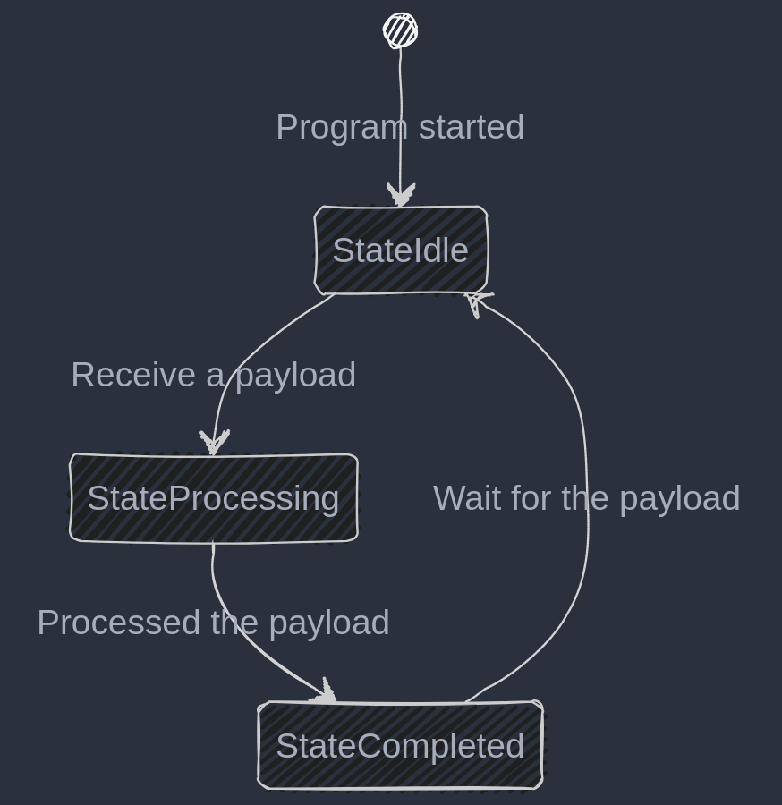

# Go ~~101~~ 102 & design patterns


Code examples and this presentation are available in <https://github.com/weezel/meetup/150125>

---

# Outline of the presentation

- Next steps after completing Go's introductory tutorial
- Recap of how the language has changed lately
- Explore design patterns that can assist in development
- Key takeaways
  - Introduce (hopefully!) more ergonomic and efficient way to use Go
  - Use the new(ish) functions and concepts more proficiently

---

### Define: Ville Valkonen


- Father of two, husband of one (wife said don't mix 'em up)
- Passionate about operating systems since 90s
  - Been using Linux since ~2000
  - Been using OpenBSD since ~2005
- Started my career as a sysadmin
  - Did coding on my freetime & in university
  - Systems hardening lead to learn tricks which hackers have in their pocket

---

# Notable changes in Go past years


- Modules (Initial support 1.11 & 11.12, default in 1.13)
- Generics (1.18)
  - slices and maps
- Error handling (1.20)
- Iterators (1.22)

---

# General tips and recap (for loop)

- For loop variable initialization from call by value to call by reference
- How that affected `for` loops until go 1.22:

```go
numbers := []int{1, 2, 3}
for _, number := range numbers {
    go func() {
        fmt.Printf("%d ", number)
    }()
}
// Before 1.22 this printed: 3 3 3
```

- Also introduced in version 1.22:

```go
for i := range 3 {
  fmt.Println(i)
}
```

---

## General tips and recap (cmp.Or)

- Use `cmp.Or()` to check `nil` or empty values and to set defaults
  - An example (requires version 1.22):

  ```go
  port := cmp.Or(
    os.Getenv("HTTP_PORT"),           // If this doesn't exist, move to next one
    os.Getenv("HTTP_LISTENING_PORT"), // If this doesn't exist, move to next one
    "8000",                           // Eventually use this if all the other have failed
  )
  ```

---

## General tips and recap (Fatal & Panic)

- Use `.Fatal()` only if you don't care `defer` to be executed
- Prefer `.Panic()` since it allows `defer` to be run, also it is possible to catch panics with `recover`
  - An example:

  ```go
      defer func() {
        if r := recover(); r != nil {
            fmt.Printf("Panic recovered. Error was: %s\n", r)
        }
    }()
  ```

- Using `gocritic` linter from `golangci-lint` catches this issue

---

## General tips (Strict JSON checking)

- By default `json.Unmarshal()` accepts everything and sets unknown fields to empty
- Pass potato or banana as an argument and `Unmarshal` is happy
- Code example on the next slide is based on [json_marshal.go](../general/json_marshal.go)

---

```go
type User struct {
  Name     string `json:"name"`
  Username string `json:"username"`
  Age      int    `json:"age,omitempty"`
}

// Would fail: {"exists": true, "name":"Alice","username":"InWonderland","age":12}
payload, err := io.ReadAll(resp.Body)
if err != nil {
  return nil, fmt.Errorf("read body: %w", err)
}

decoder := json.NewDecoder(bytes.NewReader(payload))
decoder.DisallowUnknownFields()
var user User
if err = decoder.Decode(&user); err != nil {
  return nil, fmt.Errorf("json unmarshal: %w", err)
}
```

---

# Error handling

- Since version 1.20 error handling changed drastically
- Possible to wrap errors (nested errors)
  - Modeled as a tree data structure
- Notable new functions: `errors.As`, `errors.Is`, `errors.Join`,
 `errors.Unwrap` and `fmt.Errorf`
- Error interface is:

  ```go
  type error interface {
    Error() string
  }
  ```

---

## Error handling (continued..)

- Use terse and unique error messages
  - Only needs to be unique in function's or method's context
- Wrap errors with format directive `w` aka `wrap`
- Configure `wrapcheck` linter to nag about missing wraps and `errcheck` for
  missed error checks

---

## Error handling (continued...)

- Use it like this (from [dependencyinject.go](../designpatterns/dependencyinject.go))):

```go
func (h *Handler) GetUsers(ctx context.Context) error {
  ...
  req, err := http.NewRequestWithContext(ctx, http.MethodGet, usersURL.String(), nil)
  if err != nil {
    return nil, fmt.Errorf("url request: %w", err)
  }
  resp, err := h.httpCli.Do(req)
  if err != nil {
    return nil, fmt.Errorf("get user list: %w", err)
  }
  ...
}
```

---

## Error handling (errors.Is)

- Answers to question: Is it _this_ error?
- Requires predefined errors (`var ErrTimeout = errors.New("timeout occurred")`) to work
  - E.g. File already exists:

  ```go
  f, err := os.CreateTemp("/tmp", "foo_*")
  if err != nil {
    if errors.Is(err, os.ErrExist) {
      log.Fmt("Temporary file already exists, all good")
      return
    }
    log.Panicf("Couldn't create temp file: %v", err)
  }
  ```

---

## Error handling (errors.As)

- Possible to add more content into errors
- Useful for including extra data into errors
- Next slide has a code snippet from [customerror.go](../errhandling/customerror.go):

---

```go
type CustomSQLError struct {
  Err    error  // Original error
  Query  string // SQL query that failed
  UserID int64  // User ID who ran the query
}
// Implements error.Error() interface
func (c CustomSQLError) Error() string { return fmt.Sprintf("query failed: %s", c.Err) }
func funcThatReturnsCustomErr() error {
  return CustomSQLError{
    Err:    errors.New("the real error is here"),
    Query:  "SELECT * FROM aaaaaaa;", // In real life this would assigned
    UserID: 100,
  }
}
func customErrorDemo() {
  err := funcThatReturnsCustomErr()
  if err != nil {
    var sqlErr CustomSQLError
    if errors.As(err, &sqlErr) {
      logger.Logger.Error().Err(err).Int64("user_id", sqlErr.UserID).Str("query", sqlErr.Query).Msg("SQL query failed")
    } else {
      logger.Logger.Error().Err(err).Msg("Failed to return custom error")
    }
  }
}
```

---

# Design patterns (short recap)

- Why?
  - Helps to abstract problems in higher level
  - Reusability
  - Removes dependencies
  - Maintains consistency
  - Eases maintenance

---

# Dependency injection

- Enables builtin _"mocking"_
- Implemented by using interfaces
  - Interfaces are suffixed with -er, e.g. Writ**er**, Read**er** or HTTPClient**er**
- Often used in constructors
  - Constructor takes an interface and encapsulates that into a struct field
- No direct manipulation of the fields possible outside the package scope

---

## Dependency injection (continued..)

The good:

- Abstracts libraries into methods
  - Easier to replace library afterwards
- Possible to add more functionality in implementation

The bad:

- Makes things more complex
  - New method used in a library?
    - => Add method's signature into the interface

---

## Dependency injection (continued...)

- Simplified example of [dependencyinject.go](../designpatterns/dependencyinject.go)

```go
type HTTPClienter interface {
  Do(req *http.Request) (*http.Response, error)
}

type Handler struct {
  httpCli HTTPClienter
}

func New(client HTTPClienter) *Handler {
  return &Handler{
    httpCli: client
  }
}
```

---

## Dependency injection (continued....)

```go
func (h Handler) GetURL(ctx context.Context, u *url.URL) ([]byte, error) {
  req, err := http.NewRequestWithContext(ctx, http.MethodGet, u.String(), nil)
  if err != nil { return nil, fmt.Errorf("request: %w", err) }

  res, err := h.httpCli.Do(req) // Call httpClienter Do()
  if err != nil { return nil, fmt.Errorf("http get: %w", err) }

  body, err := io.ReadAll(res.Body)
  if err != nil { return nil, fmt.Errorf("body: %w", err) }

  return body, nil
}

// Usage
handler := New(&http.Client{Timeout: time.Second * 30})
u, _ := url.Parse("https://example.com") // Error omitted, naughty
payload, err := handler.GetURL(ctx, u)
...
```

---

# Options pattern

- N arguments for the constructor
- Implemented by type defining a function pointer
- Usually prefixed with `With...`, e.g. `WithHTTPClient()`

  ```go
  type Handler struct {
    httpCli    HTTPClienter
  }
  type Option func(*Handler)

  func WithHTTPClient(client HTTPClienter) Option {
    return func(h *Handler) {
      h.httpCli = client
    }
  }
  handler := New(WithHTTPClient(http.DefaultClient))
  ```

---

## Options pattern (continued..)

The good:

- Doesn't break implementations when parameters are added or removed from constructor
- No strict order of parameters
- Encapsulates the default variables
- Minimize knobs
- Simplifies testing by allowing to mock certain resources only

---

## Options pattern (continued...)

The bad:

- If code is badly constructed or doesn't follow `With` prefix options pattern
  best practice, it can be hard to determine what options are available
- Testing all the combinations

---

# Message dispatcher

- Routes the payload to the appropriate handler
- E.g. when one endpoint handles several different JSON payloads
  - How to distinct different JSONs?
- Example code follows based on [message_dispatcher.go](../general/message_dispatcher.go)

---

## Message dispatcher (continued..)

```go
type Email struct {
  From    string   `json:"from,omitempty"`
  To      string   `json:"to,omitempty"`
  ...
  Body    []byte   `json:"body,omitempty"`
}
type SMS struct {
  From       string `json:"from,omitempty"`
  To         string `json:"to,omitempty"`
  ...
  RcptNumber string `json:"rcpt_number,omitempty"`
}
type CommonMessage struct { // Unique fields from Email & SMS structs
  RcptNumber string `json:"rcpt_number,omitempty"`
  Body       []byte `json:"body,omitempty"`
}

func MessageDispatcher(payload []byte) error {
  common := CommonMessage{}
  json.Unmarshal(payload, &common) // Naughty, errors omitted
  switch {
  case common.RcptNumber != "":
    sms := SMS{}
    json.Unmarshal(payload, &sms) // Naughty, errors omitted
  case len(common.Body) > 0:
    email := Email{}
    json.Unmarshal(payload, &email) // Naughty, errors omitted
  default:
    return errors.New("unknown type")
  }

  return nil
}

```

---

## Message dispatcher (conclusion)

The good:

- Complexity is in one place
- Easy to extend with new types

The bad:

- Can get complex

---

# State machines

- Finite state machine is based on a mathematical model which tracks states and transitions between them
- Change from one state to an another is called transition
- A few ways to model these in Go:
  - By using switch condition and iota
  - By using type defined function and returning that on each state handling function

---

## State machines (continued..)

- Functions are first class citizens in Go
  - Passed to variables
  - Passed as arguments to functions
  - Returned from functions
  - Stored in data structures

---

## State machines (depicted)

<div style="display: flex; justify-content: space-around; align-items: center;">
  
</div>

---

## State machines (iota & switch condition)

```go
type State int

func (s *State) Transition(event string) State {
  switch *s {
  case StateIdle:       if event == "start"    { return StateProcessing }
  case StateProcessing: if event == "complete" { return StateCompleted }
  case StateCompleted:  return StateIdle
  }
  return *s // No state change
}

const (
  StateIdle State = iota
  StateProcessing
  StateCompleted
)
```

---

## State machines (iota & switch condition, main)

```go
func main() {
  sm := StateIdle
  log.Printf("Initial state: %d\n", sm)
  events := []string{"start", "complete", "reset"}
  for _, event := range events {
    newState := sm.Transition(event)
    log.Printf("Event: %s, Transitioned from %d to %d\n", event, sm, newState)
    sm = newState
  }
}
```

---

## State machines (function definition)

```go
type State func(event string) State

func StateIdle(event string) State {
  if event == "start" {
    fmt.Println("transitioning from Idle to Processing")
    return StateProcessing
  }
  return StateIdle
}

func StateProcessing(event string) State {
  if event == "complete" {
    fmt.Println("transitioning from Processing to Completed")
    return StateCompleted
  }
  return StateProcessing
}

func StateCompleted(event string) State {
  fmt.Println("returning to idle state")
  return StateIdle
}
```

---

## State machines (function definition, main)

```go
func main() {
  currentState := StateIdle
  events := []string{"start", "complete", "reset"}
  for _, event := range events {
    fmt.Printf("Event: %s, ", event)
    currentState = currentState(event)
  }
}
```

---

## State machines (conclusion)

- Brings simplicity and predictability
- Functions can be used for modeling state machines
- Removing state from `iota` solution can break the state machine

---

# Future tips

- When searching Go related information from the web or asking questions from AIs, the given answer is likely outdated
  - Yes, really.
    - An example: asked ChatGPT how to concatenate path into `url.URL` object.
      - Result: Use `filepath.Join`
        - Problem: `https://` -> `https:/`
      - Expected solution: Use `http.JoinPath` which was introduced in Go 1.19.

---

### Future tips (continued..)

| URL                        | Description |
| -------------------------- | ----------- |
| <https://gobyexample.com>  | Reference guide for different concepts and functions  |
| <https://go101.org/>       | Sheds some light for the dark corners of Go |
| <https://sourcegraph.com/blog/go/gophercon-2018-rethinking-classical-concurrency-patterns> | Rethinking classical concurrency patterns |
| <https://antonz.org/go-1-24/> | Go interactive release notes (change number to e.g. 1-23) |

---

# Thanks


LinkedIn:
<https://linkedin.com/vvalkonen>

GitHub:
<https://github.com/weezel>

Koodiklinikka (Slack):
@vvalkonen
